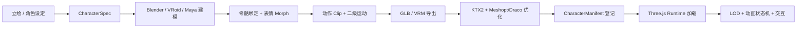

# 日式 RPG 网页人物系统架构方案

## 目标

当前角色已经不适合继续用代码拼几何体来提升质量。主流日式 RPG 人物的质量来自完整的人物资产管线：角色设定、专业建模、骨骼绑定、动画状态机、表情 morph、头发/裙摆/饰品二级运动、材质和贴图优化。代码层应该负责加载、调度、动画混合、LOD 和性能控制，而不是直接“画出”最终人物。

这个方案把人物拆成独立模块，后续 Player 和 Lyra 都通过同一套规格、资产清单和运行时策略进入游戏。

## 商用游戏的主流做法

1. 角色不是运行时代码拼出来的，而是在 Blender、Maya、3ds Max、VRoid Studio、Character Creator 等 DCC 工具中完成高质量模型、UV、贴图、骨骼和动画。
2. 游戏运行时通常加载 skinned mesh，也就是绑定到骨骼的网格。动作通过骨骼动画 clip、animation state machine 和 blend tree 混合完成。
3. 表情通常用 morph target / blendshape。日式 RPG 和视觉小说风格会特别依赖眼睛、眉毛、嘴、脸颊、瞳孔高光和眨眼。
4. 服装、发型、饰品可以模块化，但主角和关键 NPC 通常会有专门的 hero asset，而不是完全靠通用纸娃娃系统。
5. 头发、裙摆、披风、缎带、挂件等用 spring bone、物理骨骼或简化的 secondary motion 表现自然运动。
6. Web 端必须把资产预算前置：GLB/VRM 懒加载、KTX2/Basis 纹理压缩、Meshopt/Draco 几何压缩、LOD、视距裁剪和少量 shadow caster。

## 技术选型

### 运行时

继续使用 Three.js。原因是当前项目已经完成 Three.js 场景、相机、交互和资源结构，迁移到 Unity WebGL 或 Unreal Pixel Streaming 会让下载体积、部署复杂度和维护成本显著上升。我们的角色质量瓶颈不是 Three.js 本身，而是缺少离线角色资产和人物运行时架构。

### 角色资产格式

首选 GLB，兼容 glTF 2.0 标准、Three.js GLTFLoader、skinned mesh、animation clip、morph target 和 PBR/自定义材质流程。

关键日式角色可接受 VRM，特别是 Lyra 这类需要类二次元角色标准、表情、lookAt、MToon 和 spring bone 的角色。VRM 通过 `@pixiv/three-vrm` 动态加载，不进入首屏主包。

### 材质风格

采用 toon / MToon 风格，而不是写实 PBR。日式 RPG 的人物应保持清晰轮廓、柔和阴影、大眼高光和干净色块。场景可以偏 PBR，但人物材质需要更稳定的风格化表现。

### 动画系统

Three.js `AnimationMixer` 负责 clip 播放和 cross-fade。上层增加 CharacterAnimationController，统一 idle、walk、run、turn、talk、interact、emote、facial expression。不要把移动输入和具体动画 clip 直接耦合。

### 开源 AI 辅助管线

GitHub 上有可用轮子，但它们分别解决不同阶段，不能直接替代完整角色制作：

1. `StdGEN` / `CharacterGen`：优先作为日式或角色专用的图生 3D 候选生成器。
2. `Hunyuan3D` / `TRELLIS`：作为通用图生 3D 候选生成器，用于比较轮廓、服装和贴图方向。
3. `InstantMesh` / `Wonder3D` / `TripoSR`：作为较轻的单图或多视角重建基线。
4. `SkinTokens` / `UniRig`：用于候选网格的自动骨骼和蒙皮初稿，不直接视为最终绑定。
5. `VRM Addon for Blender` + `@pixiv/three-vrm`：用于需要表情、lookAt、spring bone 的关键日式角色。

这些项目的输出都必须经过 Blender 清理、拓扑修正、表情 morph、头发/裙摆/披风二级运动和网页预算审核后，才能进入 `CharacterManifest`。当前 `miemie` 没有 NVIDIA/CUDA，但有不在 `PATH` 上的 Blender 4.0.2，可用于 headless export；AI 推理应放到外部 CUDA 机器或云 GPU，产物再注册回仓库。

### 优化策略

人物资源不进入首屏同步加载。近距离 hero LOD 使用完整模型和表情；中距离降贴图和 morph；远距离使用低模或裁剪。关键角色最多 2 个投影，背景 NPC 不投影或只接收阴影。

## 模块边界

新增 `src/characters`，职责如下：

1. `CharacterSpec`：定义人物身高、体型、脸、头发、服装、鞋子、道具、动作风格。
2. `CharacterRegistry`：保存 Player、Lyra 等角色的规格，作为立绘到 3D 资产制作的源头。
3. `CharacterManifest`：声明 GLB/VRM 模型、动画 clip、材质 profile、预算和启用状态。
4. `CharacterFactory`：根据角色规格、资产清单和镜头距离生成构建计划。当前先返回 plan，后续再接 Three.js loader。
5. `runtime/CharacterRuntime`：定义 LOD、动画状态和性能预算。

现有 `src/three/CharacterModel3D.ts` 只应作为 fallback rig。下一步接入时，游戏不再直接创建 procedural rig，而是先询问 character system：如果高质量 GLB/VRM 可用则加载资产，否则回退到当前 rig。

## Player 和 Lyra 的建模要求

### Player

年轻男性主角，身高约 1.68m，偏清瘦，短发，学院制服，深蓝外套、金色学院装饰、短披风、练习法杖。需要能在第三人称镜头里清楚读出男主轮廓，同时在对话近景里有可识别的眼睛、眉毛、嘴型和表情。

### Lyra

美少女 NPC，身高约 1.55m，偏娇小，长薰衣草色头发，大紫色眼睛，星形发饰，白紫学院制服、短披肩、裙摆、魔法书。必须支持眨眼、微笑、害羞、思考、开心等表情，并且头发、裙摆、披肩和缎带有自然摆动。

## 性能预算

Web 端第一版建议：

| 层级 | 三角面 | 纹理 | 骨骼 | 表情 |
| --- | ---: | ---: | ---: | ---: |
| Hero 近景 | 30k-36k | 2K/4MB 左右 | <= 80 | <= 16 active morphs |
| Mid 中景 | 12k-16k | 1K/2MB 左右 | <= 60 | 少量或关闭 |
| Low 远景 | 4k-6k | 512/1MB 左右 | <= 40 | 关闭 |

运行时原则：

1. 玩家和正在交互的 NPC 才使用 Hero LOD。
2. 只有主角和当前对话 NPC 开启高质量 facial morph。
3. 阴影 caster 限制为 2 个关键人物。
4. GLB/VRM 按距离懒加载，模型未 ready 前保留 fallback rig。
5. KTX2/Basis 压缩贴图，Meshopt 或 Draco 压缩几何。
6. 动画 clip 复用，同骨架角色共享 locomotion 资源。

## 资产生产流程

## 实施路线

1. 已完成：建立 `src/characters` 架构模块，先把人物规格、资产清单、LOD 和构建计划独立出来。
2. 下一步：把 `src/three/CharacterModel3D.ts` 改成 character system 的 fallback runtime，而不是直接由场景决定 player / npc rig。
3. 第三步：增加 GLB/VRM loader 层，接入 `GLTFLoader`、`KTX2Loader`、Meshopt/Draco 和 `@pixiv/three-vrm` 动态导入。
4. 第四步：制作或导入 Player 和 Lyra 的高质量 test asset，并开启 manifest 的 `enabled`。
5. 第五步：接入 AnimationController，修复当前移动卡顿，加入 idle/walk/run/turn/talk cross-fade。
6. 第六步：为 Lyra 加 facial controller 和 secondary motion，对齐立绘气质。

## 主要参考

- Khronos glTF 2.0: https://registry.khronos.org/glTF/specs/2.0/glTF-2.0.html
- Three.js GLTFLoader: https://threejs.org/docs/#examples/en/loaders/GLTFLoader
- Three.js AnimationMixer: https://threejs.org/docs/#api/en/animation/AnimationMixer
- VRM: https://vrm.dev/en/
- KHR_texture_basisu: https://github.com/KhronosGroup/glTF/tree/main/extensions/2.0/Khronos/KHR_texture_basisu
